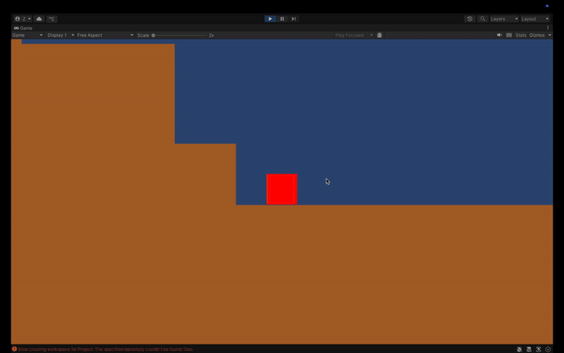

# Öoo - Unity Remake

A Unity recreation of Öoo's revolutionary gameplay where bombs become your movement, puzzle-solving, and exploration toolkit.

# Core Features

1. Bomb Interaction System

# How to Play

* Movement: ← A / D → keys to crawl left/right.
* Place Bomb: J key / Left Mouse Button.
* Detonate Bomb: K key / Right Mouse Button (requires proximity).

# Upcoming Plans

1. Modular Bomb Arsenal (8+ Types)

| Type | Core Property | Environmental Effect |
| --- | --- | --- |
| Sticky | High surface adhesion | Creates temporary wall anchors |
| Frost | Instant cryofreeze | Solidifies liquids into platforms |
| Bouncy | Elastic collisions | Enables ricochet maneuvers (2.5x rebound) |
| Acid | Progressive corrosion | Dissolves organic barriers over time |
